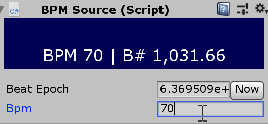
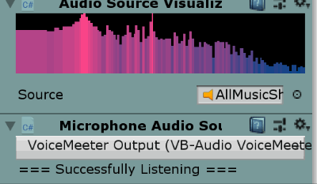
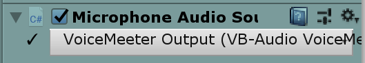

<p align="center">
    <a href="https://twitter.com/cobertos" target="_blank"></a>
    <a href="https://cobertos.com" target="_blank"></a>
</p>

# Visuals Sandbox for Unity3D 2019.1+

Tools and sandbox environment for making music visuals in Unity3D. Provides nice interfaces and debugging visuals for BPM sources, Time and Frequence space data, etc...

It requires 2019.1+ to use `VisualElement`s. The code _could_ be backported to 2017.1+ but requires some modification...

originally based on [my similar experiments/toolkit for THREE.js](https://github.com/Cobertos/MIDI-Experiment)

### Installation

1. Download or clone the repository, `git clone https://github.com/Cobertos/VisualsSandbox`
2. Open it as a Unity project

### Usage

There's not much here yet, but below is the list of components that currently exist:

#### `BPMSource`



Represents a BPM source. The base class requires manually entering the BPMSource, but can be extended to infer BPM from audio intensity data or through a MIDI input from you or your friends DAW. Has a bunch of useful properties

```
.bpm - The current bpm
.bpms - The number of beats in a millisecond
.beat - The current beat of your song, given a proper epoch
.getLastBeatTime(double frac = 1, double offset = 0) - The last time in milliseconds a beat occured
.onceEvery(double frac, double offset, OnceEveryFunc func) - Executes a function every beat
```

check out [BPMSource.cs](./Assets/Scripts/VisualsTools/BPMSource.cs) for more info

#### `AudioSourceVisualizer`



Plots the spectrum data of an audio source live.

#### `MicrophoneAudioSource`



Working with Microphone sound is a massive pain in Unity. This `MonoBehavior` sets up the attached `AudioSource` with Microphone input. Using something like [`Virtual Audio Cable/Voicemeeter`](https://www.vb-audio.com/Cable/index.htm) on Windows, you can pipe music to a Microphone input and do stuff with it in Unity.

Troubleshooting/Notes:

* If the audio is also playing in Unity (it most likely is). Attach your audio source to a mixer (in the Audio Mixer window) and attentuate it down to 0. That's the only way to mute it while still getting the unmodified spectrum data.
* Latency is very common in Unity with `Microphone.Start()`. To mitigate:
 * Make sure that your DSP Buffer is set to "Best Latency" in your project settings
 * Make sure the recording clip size is 1. The larger the size, the more potential for latency
 * The microphone records to an audio clip in a circular buffer, but if you're too far behind where the microphone is writing to in the clip, you'll experience latency as large as the clip size. Use the `AudioSourcePlaybackDebugger` until I figure out an automatic way of doing this
* If you experience garbage crackling and stuff in your microphone, make sure that your audio source outputs to a mixer. Once you start your game in the editor, edit the pitch of that mixer and set it back to 100.00%, it should go away while the game is still active. The code tries to account for this ([waiting until the microphone position is > 0](https://support.unity3d.com/hc/en-us/articles/206485253-How-do-I-get-Unity-to-playback-a-Microphone-input-in-real-time-)) but it might not work all the time.
* Using with other audio tools could potentially cause conflicts at least in Windows. [Voicemeeter](https://forum.vb-audio.com/viewtopic.php?t=87#p474) has a good write up here, but Windows audio has potentially multiple interfaces (MME, WASAPI, KS, Direct-X) to access audio devices from and doing so from multiple different ones or if any tool accesses in "Exclusive" mode can cause failures. Take care when choosing these settings in your other programs as they could conflict with Unity
 * In the case of Voicemeeter, it defaults to WDM (faster and newer), though you should use MME, otherwise it will cause Unity to hang and/or start leaking memory and requires a Unity restart.

### Contributing

No specific instructions as of now